# TriviaSpark Data Entity Relationships

## Overview

The TriviaSpark data model is designed to support a comprehensive trivia event platform with user management, event configuration, team-based participation, question management, and detailed response tracking. The database uses Entity Framework Core with SQLite and follows a relational structure optimized for real-time trivia events.

## Entity Relationship Diagram (ERD)

```mermaid
erDiagram
    Role ||--o{ User : "has many"
    User ||--o{ Event : "hosts"
    User ||--o{ EventImage : "selects"
    Event ||--o{ Question : "contains"
    Event ||--o{ Team : "has"
    Event ||--o{ Participant : "includes"
    Event ||--o{ FunFact : "displays"
    Team ||--o{ Participant : "includes"
    Question ||--o{ Response : "receives"
    Question ||--o{ EventImage : "uses"
    Participant ||--o{ Response : "submits"

    Role {
        string id PK
        string name UK
        string description
        datetime created_at
    }

    User {
        string id PK
        string username UK
        string email UK
        string password
        string full_name
        string role_id FK
        datetime created_at
    }

    Event {
        string id PK
        string title
        string description
        string host_id FK
        string event_type
        int max_participants
        string difficulty
        string status
        string qr_code
        datetime event_date
        string event_time
        string location
        string sponsoring_organization
        string logo_url
        string background_image_url
        string event_copy
        string welcome_message
        string thank_you_message
        string primary_color
        string secondary_color
        string font_family
        string contact_email
        string contact_phone
        string website_url
        string social_links
        string prize_information
        string event_rules
        string special_instructions
        string accessibility_info
        string dietary_accommodations
        string dress_code
        string age_restrictions
        string technical_requirements
        datetime registration_deadline
        string cancellation_policy
        string refund_policy
        string sponsor_information
        string settings
        bool allow_participants
        datetime created_at
        datetime started_at
        datetime completed_at
    }

    Question {
        string id PK
        string event_id FK
        string type
        string question_text
        string options
        string correct_answer
        string explanation
        int points
        int time_limit
        string difficulty
        string category
        string background_image_url
        bool ai_generated
        int order_index
        string question_type
        datetime created_at
    }

    Team {
        string id PK
        string event_id FK
        string name
        int table_number
        int max_members
        datetime created_at
    }

    Participant {
        string id PK
        string event_id FK
        string team_id FK
        string name
        string participant_token UK
        datetime joined_at
        datetime last_active_at
        bool is_active
        bool can_switch_team
    }

    Response {
        string id PK
        string participant_id FK
        string question_id FK
        string answer
        bool is_correct
        int points
        int response_time
        int time_remaining
        datetime submitted_at
    }

    FunFact {
        string id PK
        string event_id FK
        string title
        string content
        int order_index
        bool is_active
        datetime created_at
    }

    EventImage {
        string id PK
        string question_id FK
        string unsplash_image_id
        string image_url
        string thumbnail_url
        string description
        string attribution_text
        string attribution_url
        string download_tracking_url
        int width
        int height
        string color
        string size_variant
        string usage_context
        bool download_tracked
        string selected_by_user_id FK
        string search_context
        datetime created_at
        datetime last_used_at
        datetime expires_at
    }
```



## Detailed Entity Relationships

### 1. Role ↔ User Relationship

**Type:** One-to-Many  
**Description:** Each role can be assigned to multiple users, but each user has only one role.

```csharp
// Role entity
public virtual ICollection<User> Users { get; set; } = new List<User>();

// User entity  
public virtual Role? Role { get; set; }
public string? RoleId { get; set; }
```

**Relationship Configuration:**

- **Foreign Key:** `User.RoleId` references `Role.Id`
- **Delete Behavior:** `SetNull` - When a role is deleted, user's `RoleId` is set to null
- **Indexes:** `Role.Name` is unique

---

### 2. User ↔ Event Relationship

**Type:** One-to-Many  
**Description:** A user can host multiple events, but each event has only one host.

```csharp
// User entity
public virtual ICollection<Event> Events { get; set; } = new List<Event>();

// Event entity
public virtual User Host { get; set; } = null!;
public string HostId { get; set; } = null!;
```

**Relationship Configuration:**

- **Foreign Key:** `Event.HostId` references `User.Id`
- **Delete Behavior:** `Restrict` - Cannot delete a user who hosts events
- **Business Rules:** Host must exist before creating an event

---

### 3. Event ↔ Question Relationship

**Type:** One-to-Many  
**Description:** Each event contains multiple questions, and each question belongs to exactly one event.

```csharp
// Event entity
public virtual ICollection<Question> Questions { get; set; } = new List<Question>();

// Question entity
public virtual Event Event { get; set; } = null!;
public string EventId { get; set; } = null!;
```

**Relationship Configuration:**

- **Foreign Key:** `Question.EventId` references `Event.Id`
- **Delete Behavior:** `Cascade` - Deleting an event removes all its questions
- **Question Types:** `game`, `training`, `tie-breaker`
- **Ordering:** Questions have `OrderIndex` for presentation sequence

---

### 4. Event ↔ Team Relationship

**Type:** One-to-Many  
**Description:** Each event can have multiple teams, and each team belongs to exactly one event.

```csharp
// Event entity
public virtual ICollection<Team> Teams { get; set; } = new List<Team>();

// Team entity
public virtual Event Event { get; set; } = null!;
public string EventId { get; set; } = null!;
```

**Relationship Configuration:**

- **Foreign Key:** `Team.EventId` references `Event.Id`
- **Delete Behavior:** `Cascade` - Deleting an event removes all its teams
- **Team Management:** Teams have `MaxMembers` limit and optional `TableNumber`

---

### 5. Event ↔ Participant Relationship

**Type:** One-to-Many  
**Description:** Each event can have multiple participants, and each participant belongs to exactly one event.

```csharp
// Event entity
public virtual ICollection<Participant> Participants { get; set; } = new List<Participant>();

// Participant entity
public virtual Event Event { get; set; } = null!;
public string EventId { get; set; } = null!;
```

**Relationship Configuration:**

- **Foreign Key:** `Participant.EventId` references `Event.Id`
- **Delete Behavior:** `Cascade` - Deleting an event removes all participants
- **Authentication:** Participants use token-based authentication via `ParticipantToken`
- **Activity Tracking:** `JoinedAt`, `LastActiveAt`, and `IsActive` fields

---

### 6. Team ↔ Participant Relationship

**Type:** One-to-Many (Optional)  
**Description:** Teams can have multiple participants, but participants can optionally be unassigned to any team.

```csharp
// Team entity
public virtual ICollection<Participant> Participants { get; set; } = new List<Participant>();

// Participant entity
public virtual Team? Team { get; set; }
public string? TeamId { get; set; }
```

**Relationship Configuration:**

- **Foreign Key:** `Participant.TeamId` references `Team.Id` (nullable)
- **Delete Behavior:** `SetNull` - When a team is deleted, participants' `TeamId` is set to null
- **Team Switching:** `Participant.CanSwitchTeam` controls whether participants can change teams
- **Capacity Management:** Teams enforce `MaxMembers` limit

---

### 7. Question ↔ Response Relationship

**Type:** One-to-Many  
**Description:** Each question can receive multiple responses (one per participant), and each response belongs to exactly one question.

```csharp
// Question entity
public virtual ICollection<Response> Responses { get; set; } = new List<Response>();

// Response entity
public virtual Question Question { get; set; } = null!;
public string QuestionId { get; set; } = null!;
```

**Relationship Configuration:**

- **Foreign Key:** `Response.QuestionId` references `Question.Id`
- **Delete Behavior:** `Cascade` - Deleting a question removes all its responses
- **Scoring:** Responses track `Points`, `IsCorrect`, `ResponseTime`, and `TimeRemaining`

---

### 8. Participant ↔ Response Relationship

**Type:** One-to-Many  
**Description:** Each participant can submit multiple responses (one per question), and each response belongs to exactly one participant.

```csharp
// Participant entity
public virtual ICollection<Response> Responses { get; set; } = new List<Response>();

// Response entity
public virtual Participant Participant { get; set; } = null!;
public string ParticipantId { get; set; } = null!;
```

**Relationship Configuration:**

- **Foreign Key:** `Response.ParticipantId` references `Participant.Id`
- **Delete Behavior:** `Cascade` - Deleting a participant removes all their responses
- **Business Rule:** One response per participant per question (enforced at application level)

---

### 9. Event ↔ FunFact Relationship

**Type:** One-to-Many  
**Description:** Each event can have multiple fun facts displayed between questions, and each fun fact belongs to exactly one event.

```csharp
// Event entity
public virtual ICollection<FunFact> FunFacts { get; set; } = new List<FunFact>();

// FunFact entity
public virtual Event Event { get; set; } = null!;
public string EventId { get; set; } = null!;
```

**Relationship Configuration:**

- **Foreign Key:** `FunFact.EventId` references `Event.Id`
- **Delete Behavior:** `Cascade` - Deleting an event removes all its fun facts
- **Presentation:** Fun facts have `OrderIndex` and `IsActive` for display control

---

### 10. Question ↔ EventImage Relationship

**Type:** One-to-Many  
**Description:** Each question can have multiple images (though typically one), and each image belongs to exactly one question.

```csharp
// Question entity
public virtual ICollection<EventImage> EventImages { get; set; } = new List<EventImage>();

// EventImage entity
public virtual Question Question { get; set; } = null!;
public string QuestionId { get; set; } = null!;
```

**Relationship Configuration:**

- **Foreign Key:** `EventImage.QuestionId` references `Question.Id`
- **Delete Behavior:** `Cascade` - Deleting a question removes all its images
- **Unique Constraint:** `QuestionId` is unique (one image per question)
- **Unsplash Integration:** Stores Unsplash metadata and attribution information

---

### 11. User ↔ EventImage Relationship

**Type:** One-to-Many (Optional)  
**Description:** Users can select images for questions, tracking who made image selections.

```csharp
// EventImage entity
public virtual User? SelectedBy { get; set; }
public string? SelectedByUserId { get; set; }
```

**Relationship Configuration:**

- **Foreign Key:** `EventImage.SelectedByUserId` references `User.Id` (nullable)
- **Delete Behavior:** `SetNull` - When a user is deleted, image selection tracking is lost
- **Usage:** Tracks user preferences and image selection patterns

## Database Schema Characteristics

### Naming Conventions

- **Tables:** `snake_case` (e.g., `event_images`, `fun_facts`)
- **Columns:** `snake_case` (e.g., `created_at`, `max_participants`)
- **Primary Keys:** All entities use string-based UUIDs
- **Foreign Keys:** Follow pattern `{entity}_id` (e.g., `event_id`, `team_id`)

### Data Types & Conversions

- **Timestamps:** ISO string format (`yyyy-MM-ddTHH:mm:ss.fffZ`) for most entities
- **Unix Timestamps:** Used for Event dates (milliseconds) with automatic conversion
- **JSON Fields:** `Options`, `SocialLinks`, `Settings`, `SponsorInformation`
- **Boolean Fields:** SQLite-compatible boolean handling

### Indexes & Constraints

- **Unique Constraints:**
  - `User.Username` and `User.Email`
  - `Role.Name`
  - `Participant.ParticipantToken`
  - `EventImage.QuestionId`
- **Performance Indexes:**
  - `EventImage.UnsplashImageId`
  - `EventImage.DownloadTracked`
  - `EventImage.CreatedAt`

## Business Rules & Constraints

### Event Management

- Events progress through states: `draft` → `active` → `completed`/`cancelled`
- `AllowParticipants` controls visibility of teams and leaderboards
- `MaxParticipants` limits event capacity

### Team & Participant Management

- Participants can join events individually or be assigned to teams
- Team switching controlled by `Participant.CanSwitchTeam`
- Teams have configurable `MaxMembers` limit

### Question & Response System

- Questions support multiple types: `multiple_choice`, `true_false`, `fill_blank`, `image`
- Responses are scored automatically with time-based bonuses
- Questions can be categorized as `game`, `training`, or `tie-breaker`

### Authentication & Security

- Users authenticated via traditional credentials
- Participants use token-based authentication for mobile/web access
- Passwords stored securely (implementation-dependent)

### Image Management

- EventImages provide Unsplash integration with full attribution tracking
- Download tracking required for API compliance
- Image caching and metadata storage for performance

## Performance Considerations

### Query Optimization

- Navigation properties configured for efficient lazy loading
- Strategic indexing on frequently queried fields
- Cascade deletes minimize orphaned records

### Scalability Features

- String-based UUIDs prevent ID collision in distributed scenarios
- JSON fields provide schema flexibility
- Timestamp conversion supports various display formats

### Real-time Features

- `LastActiveAt` tracking for participant presence
- Response timing data for live leaderboards
- Event state management for live updates

This data model supports the full lifecycle of trivia events from creation and configuration through real-time gameplay and post-event analytics, with robust relationship management and performance optimization.
