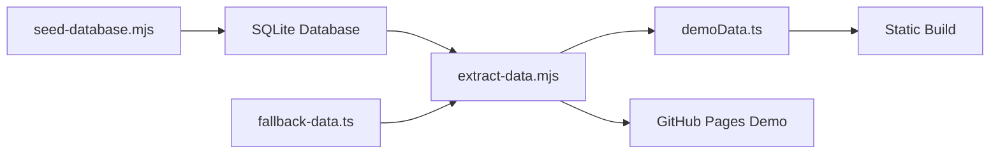

# Scripts Review: Demo Data Extraction for Non-Logged In Version

*Date: September 9, 2025*

## Summary

After reviewing the scripts directory and data extraction processes, I've identified the primary script responsible for pulling data from the SQLite database to create demo content for the non-logged in (static) version of TriviaSpark.

## Key Script: `extract-data.mjs`

**Location**: `/scripts/extract-data.mjs`

### Purpose

This script is the **primary data extraction tool** that:

- Pulls data from the SQLite database (`./data/trivia.db`)
- Generates a TypeScript file with current event data
- Creates demo content for static builds (GitHub Pages deployment)
- Provides fallback data when database is unavailable

### Key Features

1. **Database Connection**
   - Uses `@libsql/client` and `drizzle` ORM
   - Connects to local SQLite database or Turso (distributed)
   - Handles missing database gracefully

2. **Data Extraction Process**

   ```javascript
   // Extracts from 3 main tables:
   - events (up to 5 most recent)
   - questions (all questions with order)
   - fun_facts (active facts only)
   ```

3. **Output Generation**
   - Creates `/client/src/data/demoData.ts`
   - Includes metadata about extraction process
   - Provides build information for debugging

4. **Fallback Handling**
   - Uses `/client/src/data/fallback-data.ts` when database unavailable
   - Generates minimal inline data for CI/CD environments
   - Ensures static build never fails due to missing data

### Usage Patterns

**Automatic Execution:**

```bash
# Called automatically by static build
npm run build:static
```

**Manual Execution:**

```bash
# Direct script execution
node scripts/extract-data.mjs
```

## Supporting Files

### 1. Generated Demo Data (`/client/src/data/demoData.ts`)

- **Generated by**: `extract-data.mjs`
- **Content**: Current database data in TypeScript format
- **Last Updated**: 2025-09-05 (from database)
- **Primary Event**: "Coast to Cascades Wine & Trivia Evening"
- **Questions**: 10 wine/geography/Rotary themed questions
- **Fun Facts**: 5 Rotary and wine trivia facts

### 2. Fallback Data (`/client/src/data/fallback-data.ts`)

- **Purpose**: Static fallback when database unavailable
- **Content**: Hardcoded demo event and questions
- **Usage**: Development/CI environments without database

### 3. Database Seeder (`/scripts/seed-database.mjs`)

- **Purpose**: Populates database with sample data
- **Content**: Creates the source data that `extract-data.mjs` pulls from
- **Event**: "Coast to Cascades Wine & Trivia Evening"
- **Data**: 10 questions, 5 fun facts, 2 demo users, 2 teams

## Data Flow for Demo Version



1. **Development**: `seed-database.mjs` populates database
2. **Extraction**: `extract-data.mjs` pulls current data
3. **Generation**: Creates `demoData.ts` with live data
4. **Fallback**: Uses `fallback-data.ts` if database unavailable
5. **Deployment**: Static build uses extracted data for demo

## Current Demo Content

**Event**: Coast to Cascades Wine & Trivia Evening

- **Type**: Wine dinner fundraiser
- **Theme**: Pacific Northwest wines + Rotary Club
- **Questions**: 10 mixed-difficulty questions covering:
  - Wine regions (Willamette Valley, Oregon viticulture)
  - Geography (Mount Rainier, Cascade Mountains, Oregon Coast)
  - Rotary Club history and service
- **Fun Facts**: 5 trivia items about Rotary service and wine history

## Key Findings

1. **Single Source of Truth**: `extract-data.mjs` is THE script for demo data
2. **Robust Fallback**: Multiple layers ensure static build never fails
3. **Fresh Data**: Pulls current database content, not stale hardcoded data
4. **CI-Friendly**: Handles environments without database access
5. **Well-Documented**: Clear output and error messaging

## Recommendations

1. **Current Setup**: The script is well-designed and handles edge cases properly
2. **Data Freshness**: To update demo content, modify the seeded data and re-run extraction
3. **Testing**: Run `npm run build:static` to verify data extraction works
4. **Monitoring**: Check build logs to ensure database connection succeeds

The `extract-data.mjs` script successfully serves as the bridge between the live database and the static demo version, ensuring visitors get current, engaging content even without backend functionality.
